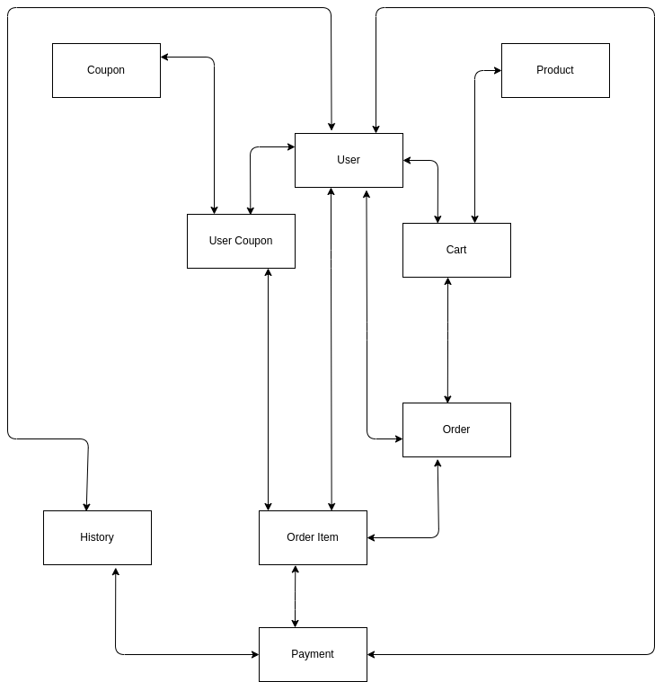

# Royal Shop

Welcome to ***`Royal online shop`*** platform!

This platform will let users to manage online shopping.

If you wanna add features like `Notification`, `Role base` system & etc. clone the repo create new branch, make changes to the project and finally push your code.

<h2>
Table of contents:
</h2>

<a href="#features">Features</a>  

<a href="#technology stacks">Technology Stack</a>  

<a href="#setup">Setup</a>  

<a href="#backend">Backend Documentation</a>  

<a href="#frontend">Frontend Documentation</a>  

<a href="#contributing">Contributing</a>  

## Features

This platform has these features like:

- Registration via OTP and dynamic **USERNAME_FIELD**
- Authentication using **JWT**
- Cart scenarios
- User's Wishlist
- Full featured Admin Queries
- Payment Integration
- Progress tracking
- Coupon scenarios

## Technology Stacks

We will use these technologies to manage our application:

- **Backend**: Django rest framework

- **Frontend**: React 

- **DevOps**: Docker

- **Database**:PostgreSQL

- **Authentication**: OTP 

- **Cache database**: Redis, Celery

## Setup

We use **Docker** to containerize backend and frontend together.

## Backend

I will use Service-Repository design pattern for **Royal** shop.

We have 5 main Django-applications here:
- ***`user`***: to let users create and manage their accounts.
- ***`store`***: to let users create and manage their carts, orders etc.
- ***`dashboard`***: to let admin see the application status
- ***`club`***: to let customers share their experiences with our app
- ***`payment`***: if any customer wants to buy something, go ahead and allow him/her

The first concept in designing a good backend is ER diagram.

Here is the core functionalities of our ECommerce with ER:

of course this is not the whole Data Base of our api but, It contains the main idea of our ECommerce.

## Frontend

## Contributing

If you wanna create new features like **Vendor** or **Notification**, follow these steps:

- clone the repository:

        git clone remote_address

- create and switch to your feature branch:

        git checkout -b vendor_feature

- make your changes to the project 

- push your code to remote repository

        git push -u origin vendor_feature

- pull your request to remote repo
